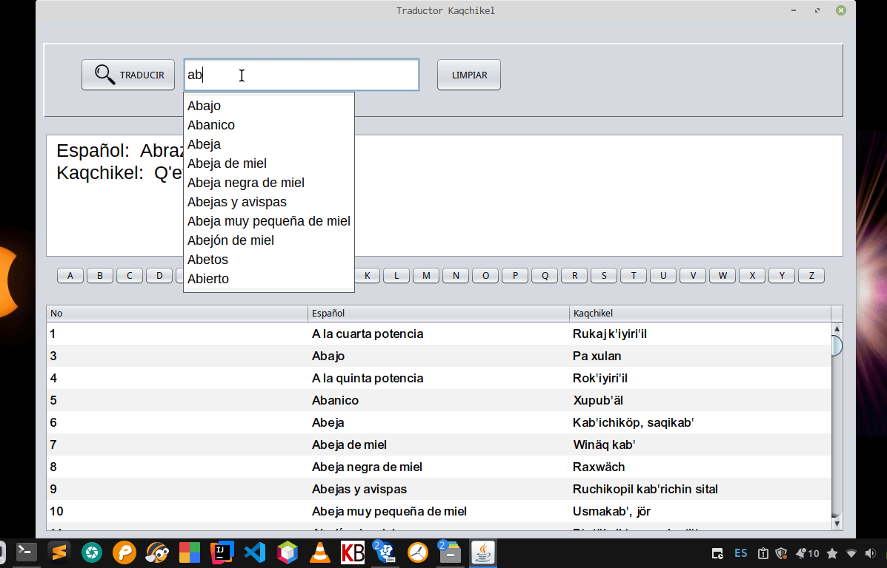

# Traductor Español a Kaqchikel

## Descripción

Software de traducción desarrollado en Java que permite la conversión de Español a Kaqchikel, se espera conversión bidireccional en futuras actualizaciónes, el idioma kaqchikel es uno de los idiomas mayas más habladas en Guatemala. El proyecto surge como una herramienta educativa y cultural para facilitar el aprendizaje y preservación de esta lengua indígena. 

## Capturas de Pantalla



# 🖥️ Kaqchikel

     

Una aplicación de escritorio desarrollada en Java Swing con Maven.

## 🚀 Comenzando

### Prerrequisitos

- **Java SDK 17 o superior** ([Descargar](https://adoptium.net/))

- **Maven 3.6+** ([Descargar](https://maven.apache.org/))

- **Git** ([Descargar](https://git-scm.com/))

### Instalación

1. **Clonar el respositorio**
   
   ```bash
    git clone https://github.com/Melkisetek/Kaqchikel.git
      cd Kaqchikel
   ```

2. **Compilar el proyecto**
   
   ```bash
   mvn clean compile
   ```

3. Ejecutar la aplicación 
   
   ```bash
   # Opción 1: Usando Maven
    mvn exec:java -Dexec.mainClass="com.traductor.kaqchikel.App"
   
   # Opción 2: Generar JAR ejecutable
   mvn clean package
   java -jar target/Kaqchikel-1.2-jar-with-dependencies.jar
   ```

### Estructura del Proyecto


### ⚙️ Configuración

1. Importatr en IDE
   
   * **Apache NetBeans:** File -> Open -> Seleccionar carpeta del proyecto
   
   * **IntelliJ IDEA**: File → Open → Seleccionar carpeta del proyecto
   
   * **VS Code**: Abrir carpeta → Aceptar importación Maven
